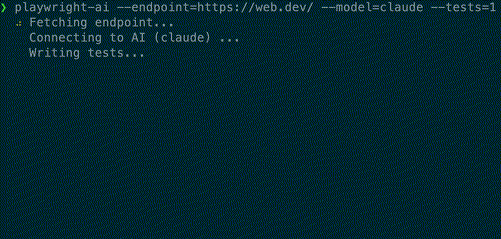

# playwright-ai

> Command-line utility to generate LLM-based [Playwright](https://playwright.dev/) tests

⚠️ Warning this tool is experimental and is still under development.


# Usage

Supported models:

- Anthropic's Claude - configure API key with `ANTHROPIC_API_KEY`.
- OpenAI's GPT3 and GPT4 - configure API key with `OPENAI_API_KEY`.

## Quick start

- Make sure you have the most basic Playwright installation with `npm init playwright@latest`. See https://playwright.dev/docs/intro#installing-playwright for details.
- Install the CLI:

```
npm -g playwright-ai
```

- Obtrain the API key for the LLM model of your choice: [Anthropic](https://www.anthropic.com) or [OpenAI](https://openai.com/).
- Execute the CLI from project directory:

```
playwright-ai --endpoint=https://example.com --model=claude --tests=1
```

- After the CLI is done, it will generate the tests into the Playwright test directory. As the tests generate, the CLI will have both passing and failing tests. The failing tests will have to be manually fixed by the user of the tool.



## Core Options

### --endpoint (-e) :: `String`

**This option is required.**

The endpoint option specifies the API endpoint to call. `playwright-ai` will browse to this endpoint and process it for generating the tests.

### --model (-m) :: `String`

_Default_: `gpt-4`.

The LLM model to use to generate the tests.
Available options: `gpt-3`, `gpt-4`, `claude`.

### --tests (-t) :: `Number`

_Default_: `1`.

Number of LLM-based tests to generate.

## CLI Options

### --help

Displays CLI command help.

### ---version

Shows CLI version.

## Release History

See the [CHANGELOG.md](CHANGELOG.md).

## TODO

- Support for other models
- More complex test cases

## License

[MIT](LICENSE)
